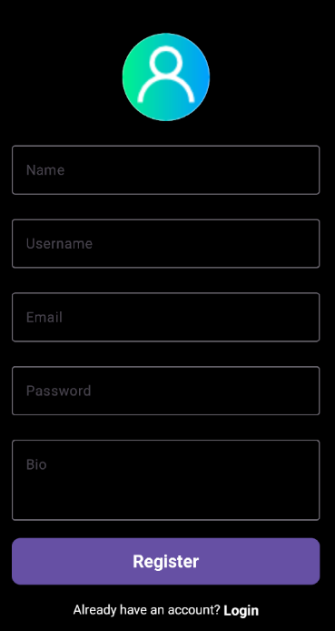
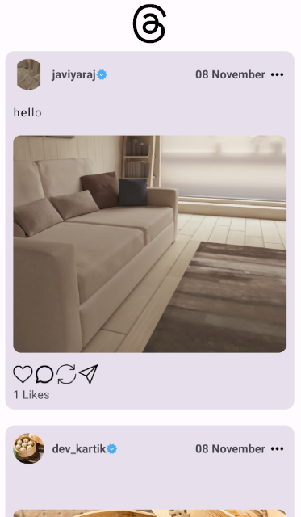
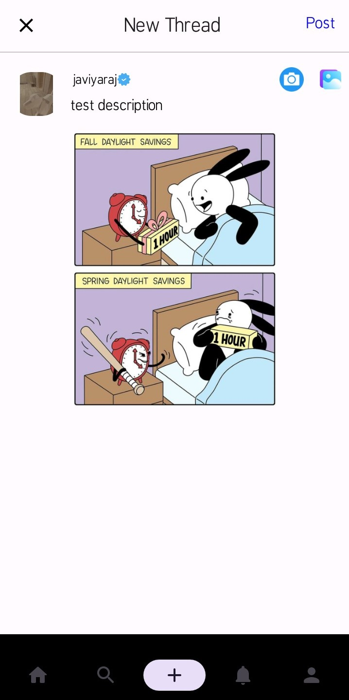
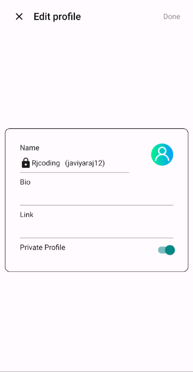
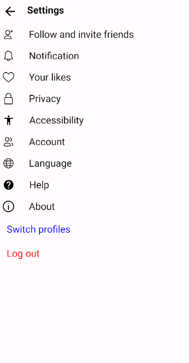

    

# Thread App

Threads is an online social media and social networking service operated by Meta Platforms. The app offers users the ability to post and share text, images, and videos, as well as interact with other users' posts through replies, reposts, and likes.
## Author

[//]: # (- [@javiyaraj]&#40;https://github.com/JAVIYARAJ&#41;)

## Documentation

- [Jetpack Compose](https://developer.android.com/jetpack/compose/documentation)

- [Firebase Authentication](https://firebase.google.com/docs/auth)

- [Firebase Realtime Database](https://firebase.google.com/docs/database)

- [Cloud Storage](https://firebase.google.com/docs/storage)

- [Coil image library](https://coil-kt.github.io/coil/compose/)

- [Material 3](https://developer.android.com/jetpack/androidx/releases/compose-material3)

## Features

- create post
- thread post listing
- dynamic profile routing
- profile
- search user

## Tech Stack

**Programing language:** kotlin

**Framework:** Jetpack compose

**Database:** Firebase database

**Library:** coil, material3, constraint layout, navigation, live data

## Screenshots

   

  

  

  

